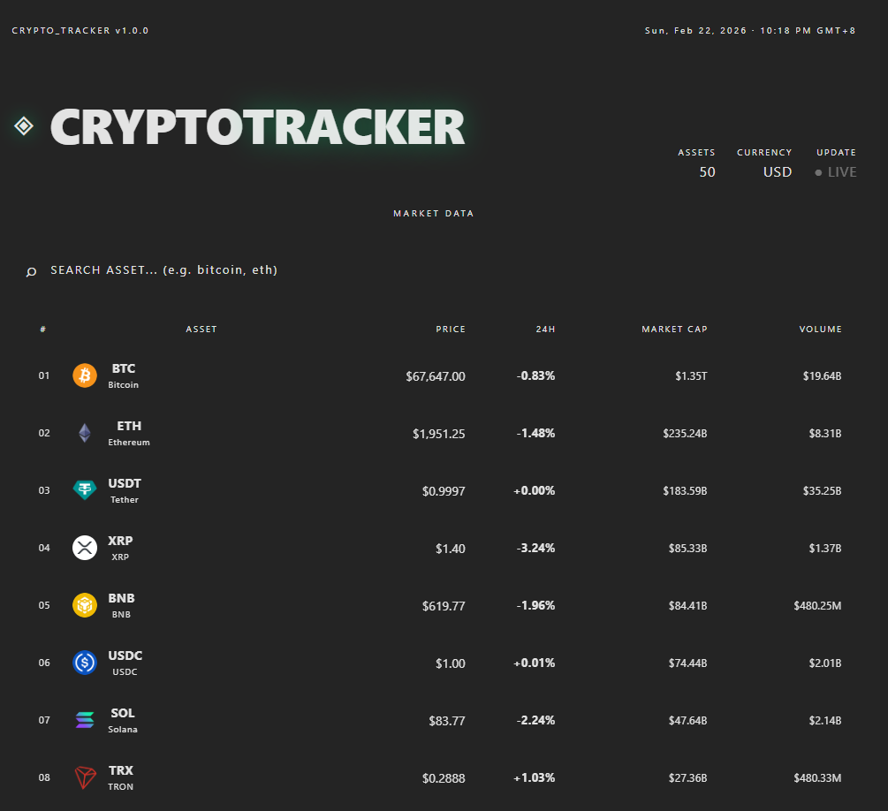
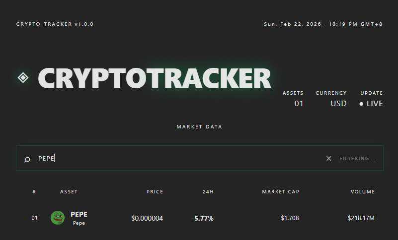
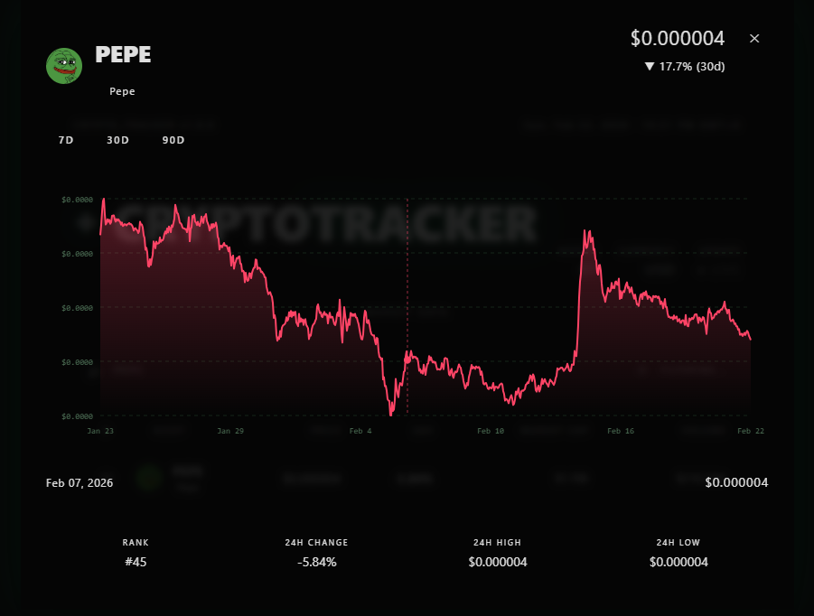

# Crypto Tracker

A real-time cryptocurrency tracker with price charts and live market data, built with React and zero paid APIs.

🔗 **Live Demo** 👉 **https://cryptotracker-three-livid.vercel.app**

---

## 📸 Screenshots





---

## 🚀 Features

- Real-time price updates (auto-refresh every 60 seconds)
- Live search and filter by name or symbol
- Price history charts for 7, 30 and 90 day periods
- Interactive chart with hover tooltip
- 24h high/low, market cap and volume data
- Fully responsive layout

---

## 🛠 Technologies Used

- React 19 (with Hooks)
- JavaScript (ES6+)
- Vite (build tool)
- CSS3 (Grid, Flexbox, Custom Properties, Animations)
- CoinGecko Public API (free, no API key required)
- SVG (for charts, no external chart library)

---

## 🧠 Key Concepts Practiced

- Component-based architecture (breaking UI into reusable pieces)
- React Hooks: `useState` for state management, `useEffect` for side effects
- Async/Await with the Fetch API for HTTP requests
- Conditional rendering (`loading`, `error`, `empty state`)
- Controlled inputs (search bar driven by React state)
- Data transformation (mapping API response to chart coordinates)
- SVG path generation from JavaScript math
- CSS variables for consistent theming
- Responsive design with CSS Grid

---

## 📦 Project Structure

```
crypto-tracker/
│
├── public/
├── src/
│   ├── assets/
│   │   └── img/
│   │       ├── Image1.png
│   │       ├── Image2.png
│   │       └── Image3.png
│   ├── components/
│   │   ├── css/
│   │   │   ├── Header.css
│   │   │   ├── SearchBar.css
│   │   │   ├── CryptoList.css
│   │   │   ├── CryptoCard.css
│   │   │   └── CryptoModal.css
│   │   ├── Header.jsx          # Title, live badge, asset counter
│   │   ├── SearchBar.jsx       # Controlled search input with clear button
│   │   ├── CryptoList.jsx      # Maps coin data into CryptoCard rows
│   │   ├── CryptoCard.jsx      # Single coin row with price and change
│   │   └── CryptoModal.jsx     # Chart modal with period selector
│   ├── App.jsx                 # Root component, state and data fetching
│   ├── App.css                 # Global styles and theme variables
│   ├── index.css               # Minimal reset
│   └── main.jsx                # React entry point
├── index.html
├── vite.config.js
└── package.json
```

---

## ▶️ How to Run Locally

```bash
# Clone the repository
git clone https://github.com/Math2034/crypto-tracker.git

# Navigate into the project
cd crypto-tracker

# Install dependencies
npm install

# Start dev server
npm run dev
```

Then open `http://localhost:5173` in your browser.

> **Note:** The app uses the [CoinGecko Free API](https://www.coingecko.com/en/api). No API key needed, but the free tier has rate limits, if the chart fails to load, wait a moment and try again.

---

## 📈 Future Improvements

- Add portfolio tracker (buy price vs current price)
- Favourite coins with localStorage persistence
- Dark/Light theme toggle
- Price alerts via browser notifications
- Backend integration for saved portfolios

---

## 👤 Author

**Matheus Ramos**
IT student building practical front-end projects
Based in Perth, Australia

GitHub: [https://github.com/Math2034](https://github.com/Math2034)
